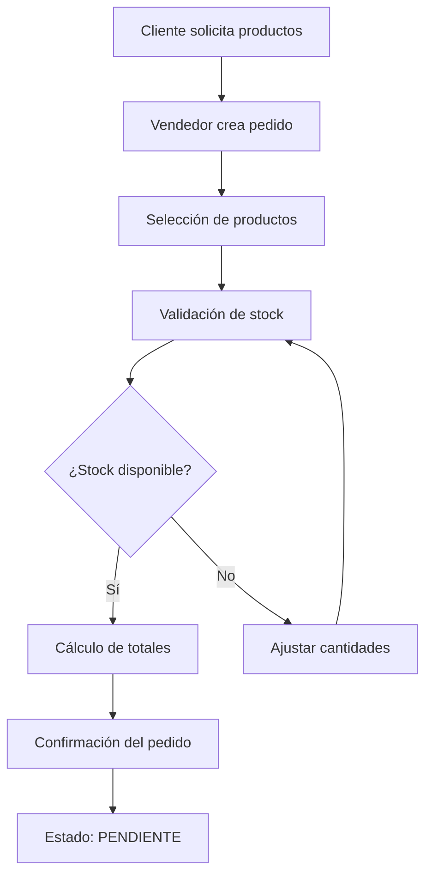
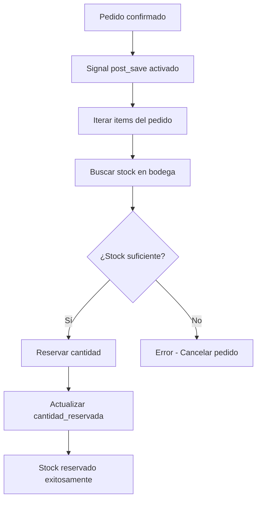
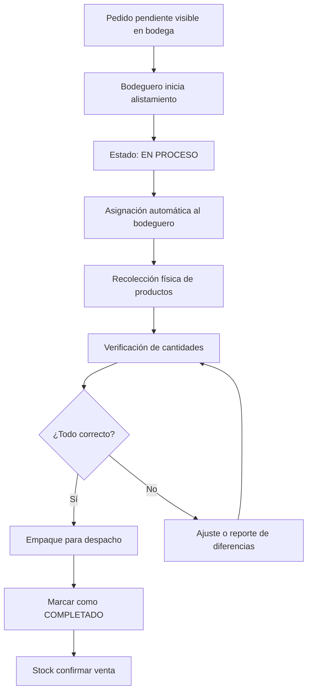
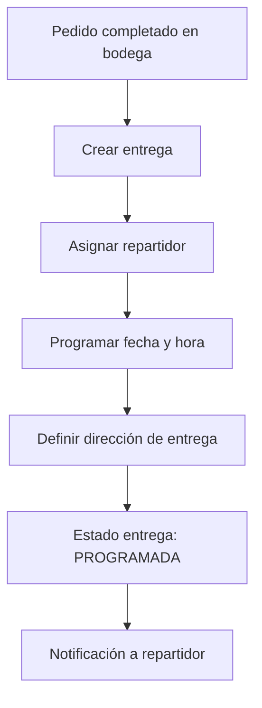
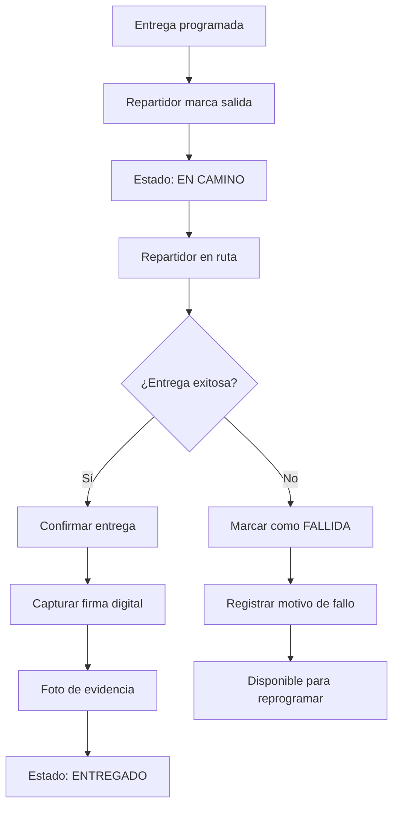
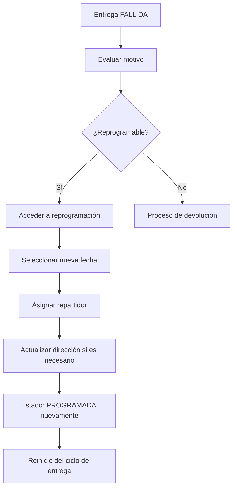
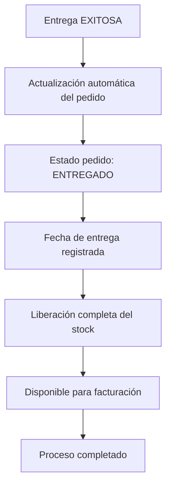

# 🚚 Flujo Completo: Del Pedido a la Entrega al Cliente Final

## Resumen del Proceso Completo

El sistema maneja un flujo integral de **8 etapas principales** desde que se crea un pedido hasta que llega al cliente final, con múltiples actores y controles de calidad.

---

## 📋 Etapa 1: Creación del Pedido

### Actores Involucrados
- **Vendedor** o **Cliente** (en línea)
- **Sistema** (validaciones automáticas)

### Estados Posibles
- `borrador` - Pedido en construcción
- `pendiente` - Pedido confirmado, esperando procesamiento

### Proceso Detallado


### Funcionalidades Clave
- ✅ **Creación Directa**: Sin necesidad de cotización previa
- ✅ **Validación de Stock**: Verificación en tiempo real
- ✅ **Cálculos Automáticos**: Subtotal, descuentos, IVA, total
- ✅ **Selección de Bodega**: Asignación según ubicación

### Herramientas Utilizadas
- **URL**: `/ventas/pedidos/nuevo/`
- **Template**: `pedido_form.html` con búsqueda dinámica de productos
- **Validaciones**: Stock disponible, productos activos, descuentos válidos

---

## 🔄 Etapa 2: Reserva de Stock

### Actores Involucrados
- **Sistema** (automatizado via signals)
- **Gestor de Inventario**

### Estados del Pedido
- `pendiente` → Stock reservado automáticamente

### Proceso Automático


### Funcionalidades de Reserva
- **Transaccionalidad**: Reserva atómica (todo o nada)
- **Trazabilidad**: Registro del usuario y pedido
- **Control Concurrente**: `select_for_update()` para evitar conflictos
- **Liberación Automática**: Si el pedido se cancela

---

## 📦 Etapa 3: Alistamiento en Bodega

### Actores Involucrados
- **Bodeguero** (personal de almacén)
- **Supervisor de Bodega**

### Estados del Pedido
- `pendiente` → `proceso` → `completado`

### Proceso de Alistamiento


### Herramientas de Bodega
- **URL**: `/ventas/pedidos/alistamiento/`
- **Filtros Disponibles**:
  - `Todos` - Vista completa para supervisión
  - `Pendientes` - Solo pedidos sin asignar
  - `En Proceso` - Solo pedidos asignados al usuario actual

### Funcionalidades de Alistamiento
- ✅ **Asignación Automática**: El pedido se asigna al bodeguero que lo inicia
- ✅ **Control de Stock**: Verificación de disponibilidad en tiempo real
- ✅ **Vista Personalizada**: Cada bodeguero ve solo sus pedidos en proceso
- ✅ **Indicadores Visuales**: Estado de stock y progreso del alistamiento

---

## 📝 Etapa 4: Creación de Entrega

### Actores Involucrados
- **Personal de Despacho**
- **Coordinador de Entregas**
- **Sistema de Routing**

### Estados del Pedido
- `completado` → Elegible para crear entrega

### Proceso de Programación


### Información de Entrega
- **Repartidor Asignado**: Usuario con role `repartidor`
- **Fecha Programada**: Fecha y hora de entrega estimada
- **Dirección**: Dirección específica de entrega (puede diferir de la del cliente)
- **Teléfono de Contacto**: Para coordinación durante la entrega
- **Observaciones**: Instrucciones especiales

---

## 🚚 Etapa 5: Despacho y Seguimiento

### Actores Involucrados
- **Repartidor**
- **Cliente** (recepción)
- **Sistema de Tracking**

### Estados de Entrega
- `programada` → `en_camino` → `entregado` ✅
- `programada` → `en_camino` → `fallido` → **[REPROGRAMAR]** → `programada`

### Proceso de Entrega


### Herramientas del Repartidor
- **URL**: `/ventas/entregas/repartidor/`
- **Acciones Disponibles**:
  - **Marcar Salida**: Cambio de `programada` a `en_camino`
  - **Completar Entrega**: Captura de firma y evidencia
  - **Marcar Fallida**: Registro de motivo de fallo
  - **Ver Ruta**: Planificación de entregas por zona

### Evidencia de Entrega
- ✅ **Firma Digital**: Captura en dispositivo móvil
- ✅ **Foto de Evidencia**: Comprobante visual de la entrega
- ✅ **Persona que Recibe**: Nombre de quien recibió
- ✅ **Geolocalización**: Coordenadas del punto de entrega (opcional)

---

## 🔄 Etapa 6: Manejo de Entregas Fallidas

### Proceso de Reprogramación


### Herramientas de Reprogramación
- **URL**: `/ventas/entregas/{id}/reprogramar/`
- **Campos Modificables**:
  - Nueva fecha y hora de entrega
  - Repartidor asignado (puede cambiar)
  - Dirección de entrega actualizada
  - Teléfono de contacto
  - Observaciones de reprogramación

### Motivos Comunes de Fallo
- Cliente no se encuentra en la dirección
- Dirección incorrecta o inexistente  
- Cliente solicita reprogramación
- Problemas de acceso al lugar
- Condiciones climáticas adversas

---

## 📊 Etapa 7: Confirmación y Cierre

### Estados Finales del Pedido
- `entregado` ✅ - Entrega exitosa confirmada
- `devuelto` - Cliente rechazó la entrega
- `cancelado` - Pedido cancelado antes de entrega

### Proceso de Cierre


### Automatizaciones de Cierre
- **Actualización de Pedido**: El estado se sincroniza automáticamente
- **Gestión de Stock**: Confirmación final de la venta
- **Registro Contable**: Disponible para facturación y contabilidad
- **Historial Completo**: Trazabilidad de todo el proceso

---

## 🎯 Etapa 8: Post-Entrega y Servicios

### Servicios Post-Entrega
- **Seguimiento de Satisfacción**: Encuestas automáticas (futuro)
- **Garantías y Reclamos**: Gestión de post-venta
- **Análisis de Tiempos**: Métricas de eficiencia en entregas
- **Optimización de Rutas**: Mejora continua del proceso

---

## 📈 Dashboard y Métricas del Flujo

### Métricas Clave Monitoreadas
- **Tiempo Promedio de Alistamiento**: Desde pendiente a completado
- **Tasa de Entregas Exitosas**: Porcentaje de entregas completadas vs fallidas
- **Tiempo de Entrega**: Desde salida hasta entrega
- **Pedidos por Estado**: Distribución actual del flujo

### Accesos por Rol
- **Vendedor**: Creación y seguimiento de pedidos
- **Bodeguero**: Alistamiento y control de stock
- **Repartidor**: Gestión de entregas y rutas
- **Administrador**: Vista completa y métricas globales

---

## 🔧 Herramientas y URLs del Sistema

### URLs Principales por Etapa
1. **Pedidos**: `/ventas/pedidos/` - Gestión completa
2. **Alistamiento**: `/ventas/pedidos/alistamiento/` - Vista de bodega
3. **Entregas**: `/ventas/entregas/repartidor/` - Panel del repartidor
4. **Detalle**: `/ventas/entregas/{id}/` - Información completa
5. **Reprogramación**: `/ventas/entregas/{id}/reprogramar/` - Gestión de fallos

### Estados y Transiciones Válidas
```
PEDIDO:
borrador → pendiente → proceso → completado → entregado

ENTREGA:  
programada → en_camino → entregado ✅
programada → en_camino → fallido → [REPROGRAMAR] → programada
```

---

## ✅ Beneficios del Flujo Implementado

### Eficiencia Operacional
- **Automatización**: Reservas de stock y actualizaciones automáticas
- **Trazabilidad**: Seguimiento completo del pedido hasta entrega
- **Control de Calidad**: Validaciones en cada etapa del proceso

### Experiencia del Cliente
- **Transparencia**: Estado visible en tiempo real
- **Flexibilidad**: Reprogramación de entregas fallidas
- **Evidencia**: Confirmación digital de entrega con firma y foto

### Gestión Empresarial
- **Métricas Precisas**: Tiempos reales de cada etapa
- **Control de Inventario**: Gestión automática de stock
- **Optimización**: Identificación de cuellos de botella

---

*Flujo Completamente Implementado y Funcional*  
*Sistema preparado para operaciones en producción*